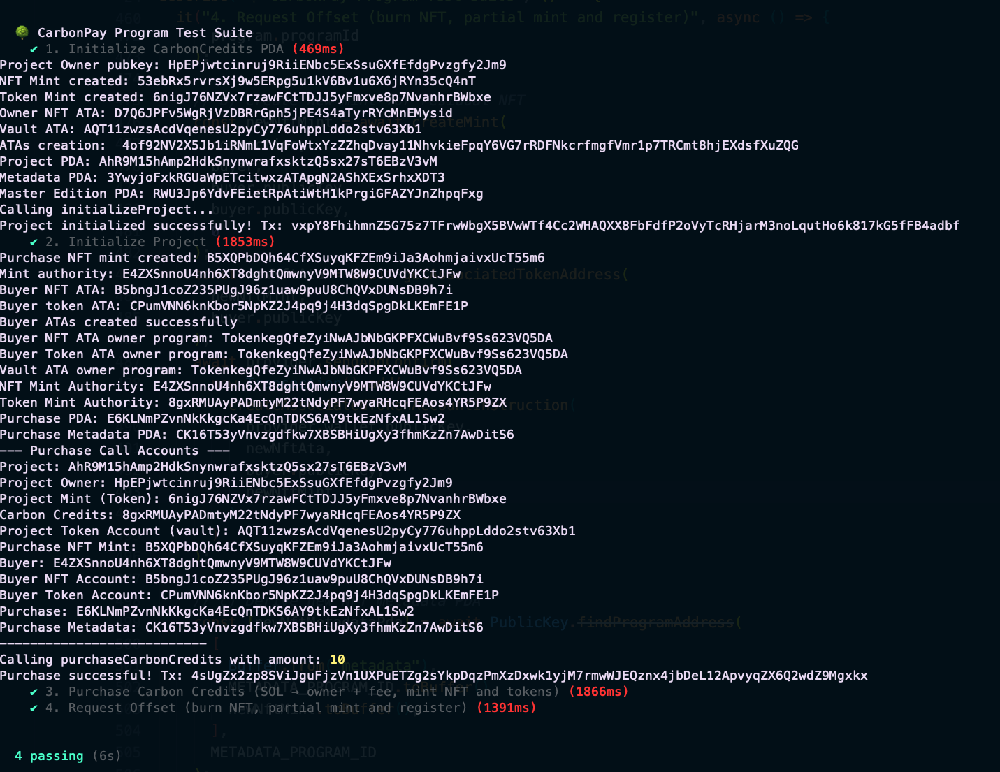

# CarbonPay Marketplace

## Overview

CarbonPay Marketplace is a decentralized platform on Solana for tokenizing, purchasing, and offsetting carbon credits. Project owners mint NFTs and fungible tokens representing carbon credits. Buyers can purchase, track, and offset their carbon footprint transparently on-chain.

## Features

- **Tokenization:** Mint NFTs and fungible tokens for carbon credit projects
- **Purchase & Transfer:** Buy carbon credits using SOL, with automatic fee distribution
- **Offsetting:** Burn tokens/NFTs to register carbon offset events
- **Tracking:** On-chain records for all purchases and offsets
- **Project Management:** Project owners can create and manage carbon credit projects
- **On-chain Metadata:** NFT metadata stored on-chain (optionally with IPFS)
- **Fee Mechanism:** Configurable fee for the CarbonPay protocol

## Tech Stack

- **Solana** (blockchain layer)
- **Anchor** (smart contract framework)
- **@solana/web3.js** (client interaction)
- **@solana/spl-token** (token operations)
- **TypeScript** (tests and scripts)
- **IPFS** (optional, for storing project metadata)
- **Jest/Mocha** (for testing, if used)
- **Solana Explorer** (for on-chain inspection)

## Getting Started

### 1. Clone the repository

```sh
git clone https://github.com/your-username/carbonpay-marketplace.git
cd carbonpay-marketplace
```

### 2. Install dependencies

```sh
anchor install
npm install
```

### 3. Build the program

```sh
anchor build
```

### 4. Run tests

```sh
anchor test
```

### 5. Deploy to Devnet

```sh
solana config set --url devnet
anchor deploy
```

### 6. Update the program (if needed)

```sh
anchor upgrade target/deploy/carbon_pay.so --program-id <YOUR_PROGRAM_ID>
```

## Tests

The test suite is in `tests/carbonpay-marketplace.ts` and covers:

- **Initialize CarbonCredits PDA**
- **Initialize Project** (mint NFT, mint tokens, create vault, transfer authorities)
- **Purchase Carbon Credits** (SOL transfer, NFT/token minting, fee distribution)
- **Request Offset** (burn NFT, partial mint, register offset)

Test output:




```
  CarbonPay Program Test Suite
    ✓ 1. Initialize CarbonCredits PDA
    ✓ 2. Initialize Project
    ✓ 3. Purchase Carbon Credits (SOL → owner + fee, mint NFT and tokens)
    ✓ 4. Request Offset (burn NFT, partial mint and register)

  4 passing (12s)
```

### Example Test Snippet

```ts
it("3. Purchase Carbon Credits (SOL → owner + fee, mint NFT and tokens)", async () => {
  // ... setup buyer, create mints, ATAs ...
  const tx = await program.methods
    .purchaseCarbonCredits(new BN(purchaseAmount))
    .accountsPartial({
      project: projectPda,
      projectOwner: projectOwner.publicKey,
      // ... more accounts ...
    })
    .signers([buyer])
    .rpc();
  // ... assertions ...
});
```

## Devnet Deployment


```
Program ID: 2Dz8KaP4i4B5CqNm7PujgH8pZyoZSKCECTDx6bssjVfw
Explorer Link: https://explorer.solana.com/address/2Dz8KaP4i4B5CqNm7PujgH8pZyoZSKCECTDx6bssjVfw?cluster=devnet
```

## Usage

### CLI

- **Airdrop SOL to your wallet:**
  ```sh
  solana airdrop 2
  ```
- **Check your balance:**
  ```sh
  solana balance
  ```
- **Deploy/upgrade program:**
  ```sh
  anchor deploy
  anchor upgrade target/deploy/carbon_pay.so --program-id 2Dz8KaP4i4B5CqNm7PujgH8pZyoZSKCECTDx6bssjVfw
  ```

### Programmatic (TypeScript/Anchor)

- **Initialize CarbonCredits:**

  ```ts
  await program.methods
    .initializeCarbonCredits()
    .accountsPartial({
      admin: provider.wallet.publicKey,
      carbonCredits: carbonCreditsPda,
      // ...
    })
    .rpc();
  ```

- **Initialize Project:**

  ```ts
  await program.methods
    .initializeProject(
      new BN(PROJECT_AMOUNT),
      new BN(PRICE_PER_TOKEN),
      new BN(CARBON_PAY_FEE),
      PROJECT_URI,
      PROJECT_NAME,
      PROJECT_SYMBOL
    )
    .accountsStrict({
      projectOwner: projectOwner.publicKey,
      // ...
    })
    .signers([projectOwner])
    .rpc();
  ```

- **Purchase Carbon Credits:**

  ```ts
  await program.methods
    .purchaseCarbonCredits(new BN(purchaseAmount))
    .accountsPartial({
      // ...
    })
    .signers([buyer])
    .rpc();
  ```

- **Request Offset:**
  ```ts
  await program.methods
    .requestOffset(new BN(offsetAmount), requestId)
    .accountsPartial({
      // ...
    })
    .signers([buyer])
    .rpc();
  ```

### Front-end

- Connect your wallet (e.g., Phantom)
- Interact with the dApp UI (if available)
- Use the Anchor IDL to generate client code

## Directory Structure

```
carbonpay-marketplace/
├── migrations/           # Anchor deployment scripts
├── programs/             # Rust smart contract source code
│   └── carbon_pay/       # Main program logic
│       ├── src/          # Rust source files
│       └── Cargo.toml    # Rust package config
├── target/               # Build artifacts (.so files, IDLs)
├── tests/                # TypeScript test scripts
│   └── carbonpay-marketplace.ts
├── Anchor.toml           # Anchor project config
├── package.json          # Node.js dependencies
├── README.md             # Project documentation
```

## Anchor Accounts & IDL

- **carbon_credits**: Stores total and offset credits
- **project**: Project metadata, owner, mints, amounts
- **purchase**: Purchase record, buyer, amount, remaining
- **offset_request**: Offset event, status, amount

IDL auto-generated at `target/idl/carbon_pay.json`.


